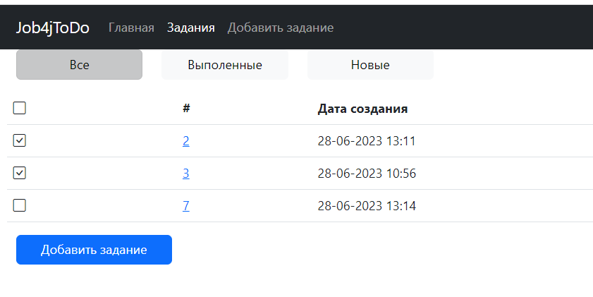
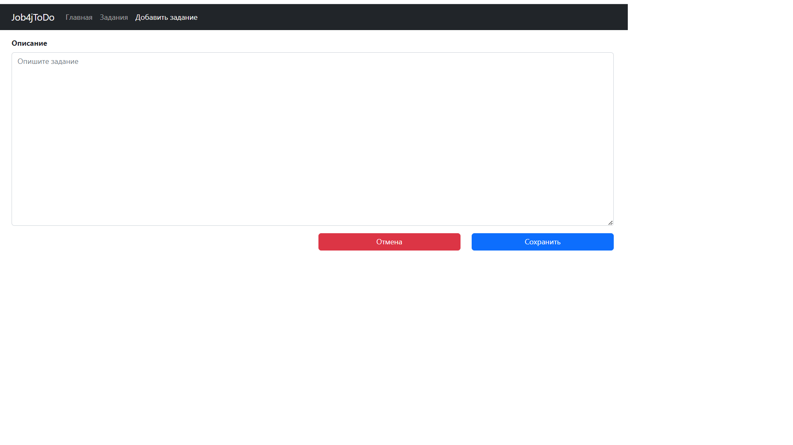
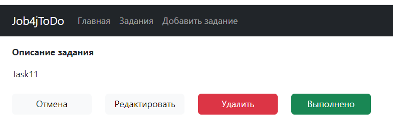
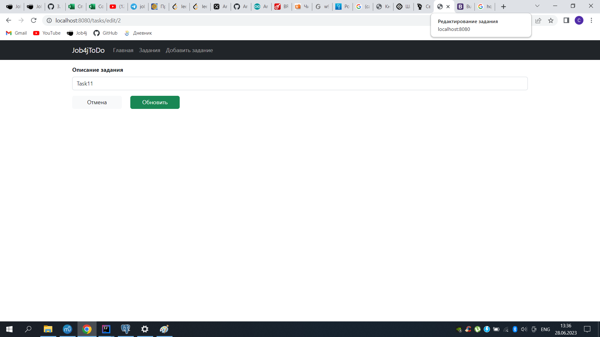

<h3>Job4j_ToDo</h3>

    Это учебное приложение - онлайн-сервис отслеживания заданий. 
    На сайте пользователь может посмотреть актуальные задания, создавать новые задания, 
    удалять и редактировать существующие задания. А также отмечать выполнение задания.

<h4>Технологии</h4>
<ul>
    <li>Java 17</li>
    <li>Spring boot 2.7.6</li>
    <li>PostgreSQL 13, Sql2o 1.6, Liquibase 4.15</li>
    <li>Maven 3.8.5, Tomcat</li>
    <li>Thymeleaf, Bootstrap</li>
    <li>Hibernate 5.6</li>
</ul>

<h4>Требования к окружению</h4>
<ul>
    <li>JDK 17</li>
    <li>Maven 3.8.5</li>
    <li>PostgreSQl 13</li>
    <li>Браузер</li>
</ul>

<h4>Запуск проекта</h4>
<ul>
    <li>Создать базу данных todo "jdbc:postgresql://localhost:5432/todo"</li>
    <li>Собрать jar с приложением, выполнив команду "mvn/install"</li>
    <li>Запустить приложение командой java "-jar job4j_todo"</li>
    <li>Перейти в браузере по ссылке "http://localhost:8080/index"</li>
</ul>

<h4>Скриншоты с интерфейсом приложения</h4>

Главная страница 
    

Задания 
    

Добавление задания 
    

Просмотр задания 
    

Редактирование задания 
    

